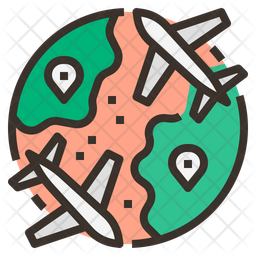

<p align="center">
  <a href="">
    
  </a>
</p>

# Flags Task

A Flags Task made for Nearcast

- [Flags Task](#flags-task)
  - [:rocket: Getting Started](#rocket-getting-started)
  - [:ledger: Architecture](#ledger-architecture)
    - [:file_folder: Data Layer](#file_folder-data-layer)
    - [:briefcase: Domain Layer](#briefcase-domain-layer)
    - [:iphone: Presentation Layer](#iphone-presentation-layer)
  - [:o: The User Interface Flow](#o-the-user-interface-flow)

## :rocket: Getting Started

1.  Install Flutter by following the official instruction at [https://flutter.dev/docs/get-started/install](https://flutter.dev/docs/get-started/install)
    &nbsp;

2.  Clone this repo using the link

    ```shell
    git clone https://github.com/ajaytitus1386/Flags.git
    ```

3.  Go to the root of the project and get the dependencies
    ```shell
    flutter pub get
    ```
4.  Next, run the on a connected device using
    ```shell
    flutter run
    ```

## :ledger: Architecture

The project follows a simple three-tier architecture consisting of Data, Domain and Presentation layers

### :file_folder: Data Layer

This layer handles both remote data calls and storage with local data sources.

- **db** : Helper class and methods for database functions
- **models** : Models of Data Objects and conversion logic to and from JSON
- **repo** : Contains the implementation of the repositories contracts in the domain layer.

### :briefcase: Domain Layer

- **entities** : The abstract class of the main data objects used in the business logic
- **repos** : Repository contracts of the intended methods to be implemented
- **usecases** : Intermediaries class where the business logic in the repos is executed.

### :iphone: Presentation Layer

Focuses on Flutter layout and the Widget Tree. Anything and everything to do with the UI is structured here

- **animation** : contains page animations
- **pages** : The individual views of the UI
- **widgets** : Reusuable and Extractable widget components
- **styling** : Constants for Colors, TextStyles, Sizes and so on

## :o: The User Interface Flow

The current build flows between two main pages: The Home Page and the Region Page

**The Home Page**: The landing page of the app. Displays the regions of the world as cards.

**The Region Page**: Using the stored data, displays a list of countries based on a region as vertical tiles.

**The Country Page**: Tapping on a country tile, displays its bordering countries and the languages spoken in the country
